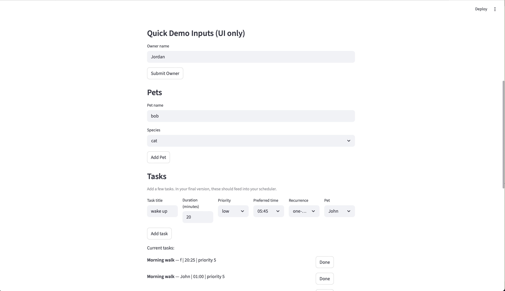
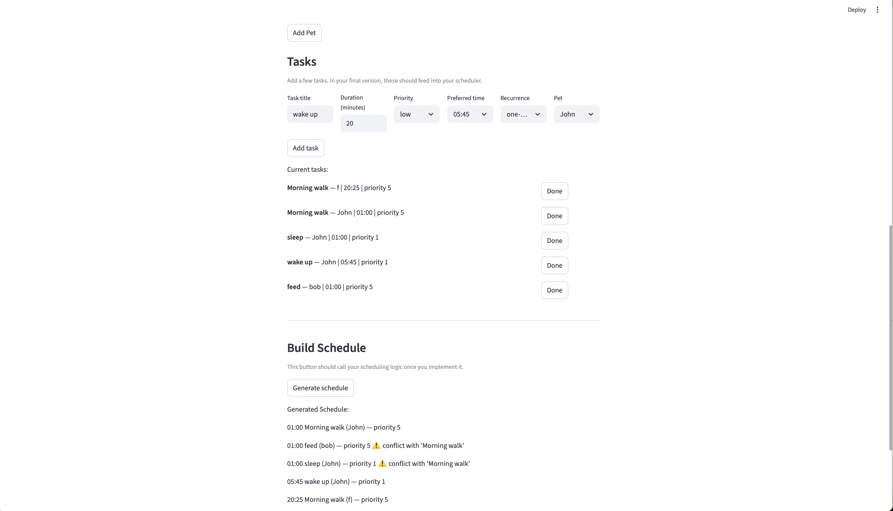

# PawPal+ (Module 2 Project)

You are building **PawPal+**, a Streamlit app that helps a pet owner plan care tasks for their pet.

## Scenario

A busy pet owner needs help staying consistent with pet care. They want an assistant that can:

- Track pet care tasks (walks, feeding, meds, enrichment, grooming, etc.)
- Consider constraints (time available, priority, owner preferences)
- Produce a daily plan and explain why it chose that plan

Your job is to design the system first (UML), then implement the logic in Python, then connect it to the Streamlit UI.

## What you will build

Your final app should:

- Let a user enter basic owner + pet info
- Let a user add/edit tasks (duration + priority at minimum)
- Generate a daily schedule/plan based on constraints and priorities
- Display the plan clearly (and ideally explain the reasoning)
- Include tests for the most important scheduling behaviors

## Getting started

### Setup

```bash
python -m venv .venv
source .venv/bin/activate  # Windows: .venv\Scripts\activate
pip install -r requirements.txt
```

### Suggested workflow

1. Read the scenario carefully and identify requirements and edge cases.
2. Draft a UML diagram (classes, attributes, methods, relationships).
3. Convert UML into Python class stubs (no logic yet).
4. Implement scheduling logic in small increments.
5. Add tests to verify key behaviors.
6. Connect your logic to the Streamlit UI in `app.py`.
7. Refine UML so it matches what you actually built.

### Features

- **Task Scheduling** — generates a daily schedule sorted by scheduled time, with ties broken by priority (high first)
- **Recurring Tasks** — tasks can repeat on a daily, weekly, or monthly cadence; completion is tracked per-cycle so recurring tasks automatically reset when due again
- **Conflict Detection** — flags tasks assigned to the same time slot with a warning instead of silently dropping them
- **Mark Complete** — tasks can be marked done (or undone) directly from the UI; one-time tasks are hidden once complete
- **Multi-Pet Support** — an owner can register multiple pets, each with their own independent task list
- **Per-Pet Filtering** — schedule can be filtered by pet name or completion status
- **Unique Task Validation** — prevents adding duplicate task titles to the same pet
- **Owner & Pet Management** — create an owner, add/remove pets, and assign tasks through the Streamlit UI


### Demo

